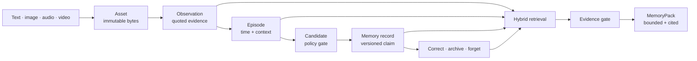

<p align="center">
  
</p>

<p align="center">
  <strong>Evidence-backed multimodal memory for agents.</strong><br>
  Turn conversations and media into bounded memory packs whose claims can be traced, corrected, and forgotten.
</p>

<p align="center">
  <a href="https://github.com/VIAIM/citefold/actions/workflows/ci.yml"></a>
  <a href="https://pypi.org/project/citefold/"></a>
  
  <a href="https://github.com/VIAIM/citefold/blob/main/LICENSE"></a>
  
</p>

<p align="center">
  <a href="#60-second-quickstart">Quickstart</a> ·
  <a href="https://viaim.github.io/citefold/">Documentation</a> ·
  <a href="https://github.com/VIAIM/citefold/blob/main/docs/architecture.md">Architecture</a> ·
  <a href="https://github.com/VIAIM/citefold/blob/main/docs/benchmarks.md">Benchmarks</a> ·
  <a href="https://github.com/VIAIM/citefold/blob/main/README.zh-CN.md">中文</a>
</p>

> **Alpha software.** Citefold is usable as an embedded Python library, but its API and on-disk format may change before 1.0. It is not a hosted service and does not provide authentication or encryption at rest.

## Why Citefold?

Most agent memory starts with chunks and similarity search. Citefold starts one step earlier: **what evidence is this memory allowed to claim?**

Every returned `MemoryPack` carries an identity scope, coverage state, selected context, and citations back to live observations or episodes. Model output and media extraction are treated as proposals—not truth—and corrections append revisions instead of silently rewriting history.



## 60-second quickstart

Citefold's local text path uses only Python's standard library. Install the alpha release from PyPI and run the deterministic demo:

```bash
python -m pip install citefold
citefold demo
```

To inspect the source or run the checked-in Python example:

```bash
git clone https://github.com/VIAIM/citefold.git
cd citefold
python -m pip install -e .
python examples/quickstart.py
```

Or embed the same flow:

```python
from citefold import Citefold, MemoryScope

memory = Citefold(".citefold")
scope = MemoryScope(
    tenant_id="acme",
    user_id="alex",
    namespace="work",
    agent_id="copilot",
    session_id="launch-planning",
)

memory.ingest_text(
    scope,
    "The launch codename is ORCHID-77. Send the brief Friday at 10:00.",
    source="chat",
)

pack = memory.recall(scope, "What is the launch codename?", token_budget=800)
print(pack.coverage)       # supported
print(pack.markdown)       # context plus an observation citation
```

Use a dedicated Citefold root: do not put source media, uploads, logs, or unrelated application files inside `.citefold`.

The checked-in example fixes its clock, so this is an excerpt from its actual output (the IDs are deterministic):

```text
# MemoryPack

## Identity Scope
- tenant_id: acme
- user_id: alex
- namespace: work
- agent_id: copilot
- session_id: launch-planning

Query: What is the launch codename and when should I send the brief?

## Relevant Messages
- user: "The launch codename is ORCHID-77. Send the launch brief on Friday at 10:00."

## Claim Citations
- observation:obs_410c8ffa27c328602633df37 | asset_8a041aa31d7c805ba8c9900d | {"char_end": 75, "char_start": 0}

## Coverage
coverage: supported
```

See [Quickstart](https://github.com/VIAIM/citefold/blob/main/docs/quickstart.md) for persistence, candidate approval, and CLI usage.

## Design principles

1. **Evidence before summary.** A claim without live evidence does not enter the returned context.
2. **Model output is a candidate, not truth.** OCR, ASR, vision, tools, and other agents remain untrusted until policy and approval allow promotion.
3. **Correction is history, not overwrite.** Revisions preserve what changed, who changed it, and why.
4. **Forgetting is a first-class operation.** Evidence tombstones invalidate dependent memory; hard deletion can also remove asset bytes.
5. **Scope is part of every operation.** Tenant, user, and namespace boundaries are enforced in storage and retrieval—not left to prompt wording.
6. **Indexes are disposable.** JSONL ledgers and content-addressed assets are authoritative; FTS and embeddings can be rebuilt.

Read the rationale in [Concepts](https://github.com/VIAIM/citefold/blob/main/docs/concepts.md).

## What works today

| Capability | Local path | Optional model path | Current boundary |
|---|---|---|---|
| Text and chat | Asset, observation, episode, lexical/FTS recall | Consolidation can propose long-term records | Built-in direct-write parsing recognizes a narrow set of explicit Chinese preference/reminder phrases |
| Images | Store bytes and accept supplied OCR/vision observations | OpenRouter vision observation | Real vision quality is not yet benchmarked |
| Audio | Store media and accept timestamped transcripts | FFmpeg normalization/chunking + OpenRouter ASR | FFmpeg is optional system software; ASR availability depends on private routing |
| Video | Store media and align supplied transcript/frame observations | Audio, subtitles, keyframes, and conservative short-clip fallback | Not a general video-understanding system |
| Recall | Lexical + SQLite FTS5 + reciprocal-rank fusion | Optional embedding signal | `token_budget` is a deterministic character proxy, not a provider tokenizer |
| Lifecycle | Candidate list/approve/reject, correct, pin/unpin, archive, decay, soft/hard forget, rebuild | — | Pin exempts an active record from decay; it does not raise trust, guarantee recall, or block deletion |
| Storage operations | Root schema status, additive v0.1 migration, verified ZIP backup, journaled restore | — | Designed for dedicated roots on local POSIX filesystems; Windows, network filesystems, multi-node operation, and exhaustive power-loss behavior are not established |
| Safety | Evidence gate, quoted media, scope isolation, provenance ledger | OpenRouter requests require ZDR and deny data collection | This SDK is not a sandbox for malicious code in the same Python process |

The [CLI reference](https://github.com/VIAIM/citefold/blob/main/docs/cli.md), [storage guide](https://github.com/VIAIM/citefold/blob/main/docs/storage.md), [multimodal guide](https://github.com/VIAIM/citefold/blob/main/docs/multimodal.md), and runnable [examples](https://github.com/VIAIM/citefold/tree/main/examples) show the supported paths without hiding optional dependencies.

## Current architecture

Citefold has three deliberately separate planes:

- **Evidence plane:** immutable assets, located observations, and time-bounded episodes.
- **Memory plane:** candidates, policy decisions, active records, conflicts, and revisions.
- **Recall plane:** rebuildable lexical/FTS/embedding indexes followed by an evidence gate and bounded renderer.

Durable state is stored in identity-scoped directories below a schema-versioned root as content-addressed assets, append-only JSONL ledgers, human-readable projections, and a rebuildable SQLite index. Normal v0.2 operations share a root lock; migration, backup, and restore take it exclusively. See [Architecture](https://github.com/VIAIM/citefold/blob/main/docs/architecture.md) for write, read, correction, deletion, and storage-management paths.

## Alpha readiness scorecard

This is a conservative **maintainer self-assessment**, not a benchmark or independent review. The dimensions should not be averaged into a “memory accuracy” score.

| Dimension | Readiness | Evidence and boundary |
|---|---:|---|
| Evidence & auditability | **4 / 5** | Live citation closure, revision history, and deletion invalidation are tested; ledgers are not cryptographically tamper-proof |
| Core correctness | **4 / 5** | Unit, integration, security, and deterministic contract tests cover the local core; independent reproduction is still pending |
| Multimodal pipeline | **3 / 5** | Text/image/audio/video evidence paths exist; real OCR, ASR, vision, and codec quality is not yet measured |
| Operations | **3 / 5** | Local deterministic tests cover a v0.1.0-generated fixture, concurrent-change preservation, verified backup, and key additive-migration/journaled-restore interruptions; private POSIX modes and root/scope locking exist, but exhaustive power-loss tests, production recovery drills, Windows/network-filesystem support, distributed operation, and a published scale envelope do not |
| Real-world validation | **1 / 5** | Public-data and synthetic evaluations exist; no longitudinal user study or field deployment has been independently evaluated |

## Measured results

These are **checked-in measurements generated on 2026-07-16**, not universal product claims. Retrieval was rerun on the Citefold `0.1.0` source-publication snapshot; it is not bound to a release commit, tag, or PyPI artifact. The QA row remains a complete historical pre-release run with a non-official judge.

| Evaluation | Result | What it establishes | What it does not establish |
|---|---:|---|---|
| LongMemEval-S retrieval diagnostic (`0.1.0` source snapshot) | Recall-any@5 **97.23%**, Recall-all@5 **84.47%**, MRR **91.39%** | Session retrieval on 470 answerable questions | End-to-end answer correctness or a tagged-release result |
| LongMemEval-S end-to-end QA (historical pre-release) | **61.80%** overall, 500/500 covered | One complete reader/judge run | Official leaderboard standing; both models were `deepseek/deepseek-chat-v3.1`, not the official judge |
| OfficeLife synthetic A/B | **100%** MemoryPack vs **33.33%** no-memory | Deterministic lift on 24 scoped office/life probes | Real-user productivity or field performance |
| Multimodal lifecycle regression | **100%** MemoryPack vs **30%** no-memory | Evidence, coverage, deletion, conflict, and injection contracts across 10 fixtures | OCR, ASR, vision-model, codec, or reader-LLM quality |

The reports, dataset hashes, environments, and caveats are preserved in [Benchmarks](https://github.com/VIAIM/citefold/blob/main/docs/benchmarks.md). Retrieval and QA are different measurements and should not be compared as if they were the same score.

## Security and privacy posture

- Raw media and model-derived text are stored as **untrusted evidence data** and rendered as quoted content.
- Memory records cannot survive recall if all of their evidence has been deleted or fails integrity checks.
- Storage is separated by tenant, user, and namespace; agent and session IDs remain provenance fields.
- OpenRouter is opt-in. Requests require ZDR, deny provider data collection, and fail closed rather than weakening those constraints.
- API keys are read from process environment variables and are not written to memory ledgers.
- Verified backups still contain sensitive durable history, and a backup made before hard deletion may retain the removed bytes; encryption and retention remain the host's responsibility.

Citefold does **not** provide user authentication, operating-system isolation, encryption at rest, a remote authorization service, or a defense against hostile code with direct filesystem access. Read the [Security model](https://github.com/VIAIM/citefold/blob/main/docs/security.md) before using sensitive data and report vulnerabilities through [SECURITY.md](https://github.com/VIAIM/citefold/blob/main/SECURITY.md).

## When to use Citefold

Use it when you need:

- an embeddable memory layer for a single-user or tenant-scoped agent;
- citations and auditable revisions, not just nearest-neighbor chunks;
- local persistence with optional model enrichment;
- explicit correction, deletion, and conflict behavior;
- a framework-neutral `MemoryPack` to inject before an agent turn.

Do not use it yet when you need:

- a managed multi-node service with authentication, quotas, or replication;
- proven high-volume or network-filesystem write semantics;
- regulated-data compliance supplied by the library itself;
- independently validated OCR, ASR, or video-understanding accuracy;
- a drop-in simulation of human memory or an autonomous agent framework.

## Agent integration

The framework-neutral `agent-turn-v1` loop is two hooks:

```python
turn = memory.prepare_agent_turn(scope, user_message)  # before the model call
assistant_message = model(user_message, turn.memory_pack.markdown)
memory.complete_agent_turn(turn, assistant_message)   # only after success
```

`turn.as_dict()` is the stable JSON-compatible contract for non-native consumers. Run [`examples/agent_loop.py`](https://github.com/VIAIM/citefold/blob/main/examples/agent_loop.py) or see [Integrations](https://github.com/VIAIM/citefold/blob/main/docs/integrations.md) for coverage, failure, trust, retry, and persistent-root semantics. Citefold does not force a particular agent framework or model provider.

## Roadmap

- **0.1:** package/CLI stability, docs, reproducible CI, and evidence-first local workflows.
- **0.2:** explicit storage schema and v0.1 migration, verified backup/restore, pin/unpin, bulk candidate-review UX, richer extraction adapters, and storage compatibility tests.
- **0.3:** real-media quality evaluation, scale/latency/cost measurements, and framework adapters.
- **1.0 gate:** stable schemas, migration policy, threat-model review, and independent real-user evaluation.

The roadmap is directional, not a delivery promise. See [Roadmap](https://github.com/VIAIM/citefold/blob/main/docs/roadmap.md) and [Limitations](https://github.com/VIAIM/citefold/blob/main/docs/limitations.md).

## Contributing

Bug reports, benchmark reproductions, documentation fixes, and narrowly scoped adapters are welcome. Start with [CONTRIBUTING.md](https://github.com/VIAIM/citefold/blob/main/CONTRIBUTING.md), use the issue templates, and include evidence for performance or quality claims.

## License and citation

Citefold is licensed under the [Apache License 2.0](https://github.com/VIAIM/citefold/blob/main/LICENSE). Benchmark datasets and protocols may have their own terms; see [THIRD_PARTY_NOTICES.md](https://github.com/VIAIM/citefold/blob/main/THIRD_PARTY_NOTICES.md).

If Citefold supports published work, use the repository metadata in [CITATION.cff](https://github.com/VIAIM/citefold/blob/main/CITATION.cff) and cite the exact release plus benchmark configuration.
