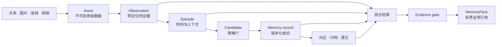

<p align="center">
  
</p>

<p align="center">
  <strong>给 Agent 使用、由证据支撑的多模态记忆。</strong><br>
  把对话与媒体变成有边界的 MemoryPack，每条结论都能追溯、纠正和遗忘。
</p>

<p align="center">
  <a href="https://github.com/jappre/citefold/actions/workflows/ci.yml"></a>
  
  <a href="LICENSE"></a>
  
</p>

<p align="center">
  <a href="#60-秒快速开始">快速开始</a> ·
  <a href="docs/index.md">文档</a> ·
  <a href="docs/architecture.md">架构</a> ·
  <a href="docs/benchmarks.md">基准测试</a> ·
  <a href="README.md">English</a>
</p>

> **当前为 Alpha。** Citefold 已可作为嵌入式 Python 库使用，但 1.0 前 API 和磁盘格式仍可能调整。它不是托管服务，也不自带身份认证或静态数据加密。

## 为什么是 Citefold？

很多 Agent 记忆系统从切块和相似度搜索开始。Citefold 先回答一个更基础的问题：**这条记忆被哪些证据允许支持？**

每个返回的 `MemoryPack` 都包含身份作用域、覆盖状态、选中上下文，以及指向仍然有效的 Observation 或 Episode 的引用。模型输出和媒体提取结果只是候选，不等于事实；纠正会追加版本，而不是静默改写历史。



## 60 秒快速开始

Citefold 的本地文本路径只使用 Python 标准库。当前 PyPI 尚未发布，直接从源码安装：

```bash
git clone https://github.com/jappre/citefold.git
cd citefold
python -m pip install -e .
citefold demo
```

随后运行 `python examples/quickstart.py`，可以查看同一条 evidence-first Python API 路径。

也可以直接嵌入应用：

```python
from citefold import Citefold, MemoryScope

memory = Citefold(".citefold")
scope = MemoryScope(
    tenant_id="acme",
    user_id="alex",
    namespace="work",
    agent_id="copilot",
    session_id="launch-planning",
)

memory.ingest_text(
    scope,
    "The launch codename is ORCHID-77. Send the brief Friday at 10:00.",
    source="chat",
)

pack = memory.recall(scope, "What is the launch codename?", token_budget=800)
print(pack.coverage)       # supported
print(pack.markdown)       # 上下文和 Observation 引用
```

完整流程见[快速开始](docs/quickstart.md)。

## 设计原则

1. **证据先于摘要。** 没有仍有效证据的结论不能进入返回上下文。
2. **模型输出是候选，不是真相。** OCR、ASR、视觉模型、工具和其他 Agent 的产物必须经过策略与审批。
3. **纠正是历史，而不是覆盖。** Revision 保留改了什么、谁改的、为什么改。
4. **遗忘是一等能力。** 证据墓碑会使依赖记忆失效；硬删除还能移除资产字节。
5. **每次操作都带作用域。** tenant、user、namespace 的边界由存储与检索执行，而不是依赖提示词。
6. **索引可以丢弃重建。** JSONL 台账和内容寻址资产才是真相来源；FTS 和 embedding 只是导航层。

设计背景见[核心概念](docs/concepts.md)。

## 当前已经做到什么

| 能力 | 本地路径 | 可选模型路径 | 当前边界 |
|---|---|---|---|
| 文本与聊天 | Asset、Observation、Episode、词法/FTS 召回 | consolidation 可提出长期记忆候选 | 内置直接写入解析只识别少量明确的中文偏好/提醒句式 |
| 图片 | 保存原图并接收外部 OCR/视觉观察 | OpenRouter 视觉观察 | 尚未评测真实视觉质量 |
| 音频 | 保存媒体并接收带时间码转写 | FFmpeg 标准化/切块 + OpenRouter ASR | FFmpeg 是可选系统软件；ASR 可用性受隐私路由影响 |
| 视频 | 保存媒体并对齐外部转写和帧观察 | 音轨、字幕、关键帧和保守短 clip 回退 | 不是通用视频理解系统 |
| 召回 | 词法 + SQLite FTS5 + RRF | 可选 embedding 信号 | `token_budget` 是确定性字符代理，不是供应商 tokenizer |
| 生命周期 | 候选 list/approve/reject、纠正、归档、衰减、软/硬删除、重建 | — | 暂无公开 pin/unpin API |
| 安全 | Evidence Gate、媒体引用、作用域隔离、来源台账 | OpenRouter 强制 ZDR 且禁止数据收集 | 不能防御同一 Python 进程中的恶意代码 |

详见 [CLI](docs/cli.md)、[多模态](docs/multimodal.md)与可运行的 [examples](examples/)。

## 技术架构

Citefold 刻意拆成三个平面：

- **证据平面：** 不可变 Asset、带定位 Observation、带时间边界 Episode；
- **记忆平面：** Candidate、策略决策、活跃 Record、冲突和 Revision；
- **召回平面：** 可重建的词法/FTS/embedding 索引，之后执行证据门和有界渲染。

持久状态位于身份作用域目录下，由内容寻址资产、追加式 JSONL 台账、人可读投影和可重建 SQLite 索引组成。写入、读取、纠正与删除流程见[架构说明](docs/architecture.md)。

## v0.1 成熟度评分

这是保守的**维护者自评**，不是 Benchmark，也没有经过独立评审。各维度不能求平均后当成“记忆准确率”。

| 维度 | 成熟度 | 证据与边界 |
|---|---:|---|
| 证据与可审计性 | **4 / 5** | 已测试有效引用闭包、Revision 历史与删除失效；台账不是密码学防篡改日志 |
| 核心正确性 | **4 / 5** | 单元、集成、安全和确定性契约测试覆盖本地核心；仍待第三方独立复现 |
| 多模态管线 | **3 / 5** | 已有文本/图片/音频/视频证据路径；尚未测量真实 OCR、ASR、视觉模型与 codec 质量 |
| 工程运维 | **2 / 5** | 已有本地嵌入、CI workflow、POSIX 私有权限和作用域锁；暂无迁移工具、分布式服务能力与公开规模边界 |
| 真实场景验证 | **1 / 5** | 已有公开数据与合成评测；尚无独立评估的长期用户研究或线上部署 |

## 当前实测效果

下面是 **2026-07-16 已检入的测量结果**，不是对所有真实场景的泛化承诺。检索评测已在 Citefold `0.1.0` 首次源码公开快照上完整重跑，但尚未绑定 release commit、tag 或 PyPI 产物；QA 仍是使用非官方 judge 的完整历史发布前快照。

| 评测 | 结果 | 能说明什么 | 不能说明什么 |
|---|---:|---|---|
| LongMemEval-S 检索诊断（`0.1.0` 源码快照） | Recall-any@5 **97.23%**、Recall-all@5 **84.47%**、MRR **91.39%** | 470 个可回答问题的 session 检索表现 | 端到端回答正确率或已打 tag 的 release 成绩 |
| LongMemEval-S 端到端 QA（历史发布前快照） | 总体 **61.80%**，500/500 完整覆盖 | 一次完整 reader/judge 验证 | 官方榜单名次；reader 和 judge 均为 `deepseek/deepseek-chat-v3.1`，不是官方 judge |
| OfficeLife 合成 A/B | MemoryPack **100%**，无记忆 **33.33%** | 24 个有作用域的办公/生活探针中的确定性增益 | 真实用户生产力或线上效果 |
| 多模态生命周期回归 | MemoryPack **100%**，无记忆 **30%** | 10 个 fixture 中的证据、覆盖、删除、冲突和注入契约 | OCR、ASR、视觉模型、codec 或 reader LLM 质量 |

原始报告、数据哈希、运行环境和限制见[基准测试](docs/benchmarks.md)。检索和 QA 是不同指标，不能当作同一个分数横向比较。

## 安全与隐私边界

- 原始媒体和模型提取文本按**不可信证据数据**存储与引用；
- 当一条 MemoryRecord 的全部证据被删除或完整性校验失败时，它不能继续通过召回；
- tenant、user、namespace 形成存储边界；agent 和 session 保留为来源字段；
- OpenRouter 仅在显式启用时使用，请求强制 ZDR、禁止供应商收集数据，不能满足时失败关闭；
- API Key 只从进程环境变量读取，不写入记忆台账。

Citefold **不提供**用户认证、操作系统隔离、静态数据加密、远程授权服务，也不能防御直接拥有文件系统权限的恶意代码。处理敏感数据前请阅读[安全模型](docs/security.md)，漏洞请按 [SECURITY.md](SECURITY.md) 报告。

## 适合与不适合的场景

适合：

- 为单用户或 tenant 隔离的 Agent 嵌入记忆层；
- 需要引用和可审计修订，而不只是向量相似切块；
- 希望本地持久化、按需接入模型增强；
- 需要明确的纠正、删除与冲突语义；
- 在每次 Agent 推理前注入框架无关的 `MemoryPack`。

暂不适合：

- 需要认证、配额、复制能力的托管多节点服务；
- 已验证的大规模写入或网络文件系统部署；
- 希望由库本身提供受监管数据合规保证；
- 依赖独立验证过的 OCR、ASR 或视频理解精度；
- 需要完整人脑模拟或自主 Agent 框架。

## Agent 集成

框架无关的集成只需要两个 hook：

```python
context = memory.recall(scope, user_message).markdown   # 模型调用前
assistant_message = model(user_message, context)
memory.ingest_chat(                                     # 完整回合后
    scope,
    [
        {"role": "user", "content": user_message},
        {"role": "assistant", "content": assistant_message},
    ],
    source="agent_loop",
)
```

运行 [`examples/agent_loop.py`](examples/agent_loop.py) 或阅读[集成指南](docs/integrations.md)。Citefold 不绑定特定 Agent 框架或模型供应商。

## Roadmap

- **0.1：** 打磨 package/CLI、文档、可复现 CI 和本地 evidence-first 工作流；
- **0.2：** 批量候选审核 UX、pin/unpin、更丰富的提取适配器和存储兼容性测试；
- **0.3：** 真实媒体质量评测、规模/延迟/成本测量和框架适配器；
- **1.0 门槛：** 稳定 schema、迁移策略、威胁模型评审和独立真实用户评估。

Roadmap 是方向，不是交付承诺。详见 [Roadmap](docs/roadmap.md)和[当前限制](docs/limitations.md)。

## 参与贡献

欢迎提交 Bug、复现实验、修正文档和范围明确的适配器。请从 [CONTRIBUTING.md](CONTRIBUTING.md) 开始，并为性能或质量结论附上证据。

## 许可证与引用

Citefold 使用 [Apache License 2.0](LICENSE)。Benchmark 数据集与协议可能有各自条款，见 [THIRD_PARTY_NOTICES.md](THIRD_PARTY_NOTICES.md)。

用于论文或研究时，请按 [CITATION.cff](CITATION.cff) 引用准确 release 与 benchmark 配置。
