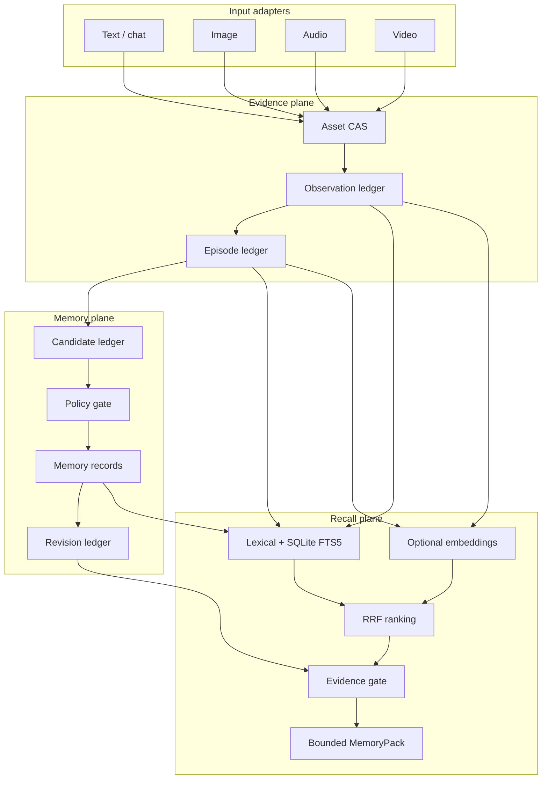
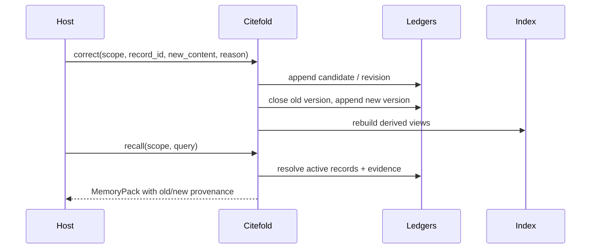

# Architecture

Citefold separates durable evidence, durable memory, and rebuildable retrieval. This makes corrections and deletions inspectable and keeps an index hit from becoming a claim by itself.

## System view



## Write path

1. **Register the asset.** Bytes are hashed and stored in the identity scope. Repeating the same asset is idempotent.
2. **Append observations.** Text spans, OCR output, ASR segments, and visual descriptions retain locators, producer, confidence, and source origin.
3. **Create an episode.** Related observations share a time range, participants, scene, and source metadata.
4. **Propose durable memory.** A candidate includes explicit evidence references, sensitivity, risk, salience, and an intended operation.
5. **Apply policy.** Trusted explicit input can activate only within supported rules. Model, tool, media, and third-party proposals remain pending by default.
6. **Append a revision.** Activation, correction, pin/unpin, archival, and deletion append auditable record-state operations.
7. **Refresh projections and indexes.** Human-readable Markdown and SQLite are derived views, not the authoritative ledger.

## Read path

1. Validate the complete `MemoryScope`.
2. Refresh a stale local index from ledgers.
3. Retrieve candidates using lexical overlap, SQLite FTS5, and optional embeddings.
4. Merge ranking signals with reciprocal-rank fusion.
5. Resolve results back to canonical records, episodes, observations, and assets.
6. Apply source-origin filters and deletion tombstones.
7. Build citation closure. An Episode hit must resolve to relevant live Observations; an embedding hit cannot stand alone.
8. Select claims and their citations inside one logical budget.
9. Return a structured `MemoryPack` and deterministic Markdown rendering.

`token_budget` is a provider-independent logical budget with a minimum of 256. The Markdown renderer enforces a deterministic ceiling of approximately `token_budget × 4` characters. Applications that need billing-exact token counts should apply their model tokenizer before the final model call.

## Correction and conflict



Contradictory supported claims can remain visible as an unresolved conflict rather than being resolved by recency alone.

## Forgetting and deletion

- `archive(record_id)` changes visibility but retains evidence.
- `forget(evidence_ref)` appends a tombstone and invalidates records whose citation closure no longer survives.
- `forget(..., hard=True)` also removes referenced original and derived asset bytes.
- Asset integrity is checked against its SHA-256. A modified asset invalidates dependent evidence even if no deletion event exists.

Deletion is explicit governance, not a claim that every copy outside Citefold has disappeared. Backups, logs, or model providers remain the host application's responsibility.

## Storage layout

```text
{root}/
  citefold-store.json            # root format, schema, store, and generation IDs
  migration-events.jsonl         # completed schema transitions, when present
  tenants/{tenant}/users/{user}/namespaces/{namespace}/
    assets/sha256/                # original and derived assets
    ledgers/
      assets.jsonl
      observations.jsonl
      episodes.jsonl
      candidates.jsonl
      records.jsonl
      revisions.jsonl
      deletions.jsonl
      consolidations.jsonl
      access.jsonl
      model_calls.jsonl
    indexes/memory.sqlite3        # rebuildable FTS / embedding index
    episodes/ profile/ tasks/ ... # human-readable projections
```

The root must be dedicated to Citefold state. A missing or empty root is initialized on the first normal operation. A non-empty root without a recognized schema 2 manifest or legacy v0.1 scope layout fails closed, as does a manifest newer than the running library.

## Storage coordination and maintenance

Normal v0.2 operations enter a shared root guard before scope and ledger access. Migration, backup, and restore enter the same guard exclusively. Within a normal write, lock order is root → scope → ledger; projections use atomic replacement. Schema generation changes invalidate live in-process store caches after restore.

The root guard combines in-process reader/writer coordination with POSIX advisory file locking. Its lock file is a sibling of the root, so a directory swap during restore does not replace the lock being held. This is designed for local POSIX filesystems. Windows cross-process parity, network/distributed filesystem locking, multi-node coordination, and atomic rename semantics outside this boundary are not established.

Schema 1 is the implicit layout written by v0.1. Schema 2 adds the explicit root manifest and migration history. Migration is an additive metadata transaction: while the v0.2 root lock is held, it also acquires every existing v0.1 scope-writer and known ledger lock, performs semantic preflight, creates and verifies a backup of durable files, checks that canonical files did not change, and commits only its state/event/manifest metadata. A concurrent legacy change aborts the transaction and is preserved; Citefold never automatically replaces v0.1 canonical data from the older backup. Interrupted recovery removes or completes only metadata whose transaction identity and hashes match.

Backups carry a per-file manifest, SHA-256 hashes, and a whole-store fingerprint. Restore verifies path safety, file integrity, and the extracted Citefold schema before it writes a root-sibling intent journal. The journal binds the archive, original directory, validated temporary replacement, and displaced path across the two directory moves. While it exists, store inspection and normal APIs fail closed with `recovery_required`. Rerunning the same restore transaction rolls the validated replacement forward; replacing a non-empty root preserves the original under the reported sibling `displaced_root` path.

v0.1 processes do not know about the root guard, so every old writer must be stopped before migration and must not be restarted against a migrated root. See [Storage, migration, backup, and restore](storage.md) for the operator and Python contracts and [Limitations](limitations.md) for validation boundaries.

## Dependencies

- Core local storage and recall: Python standard library.
- Image storage with supplied observations: no system dependency.
- Audio normalization and video extraction: optional `ffmpeg` and `ffprobe` executables.
- Model-backed observation, consolidation, and embeddings: optional [OpenRouter adapter](providers/openrouter.md).
