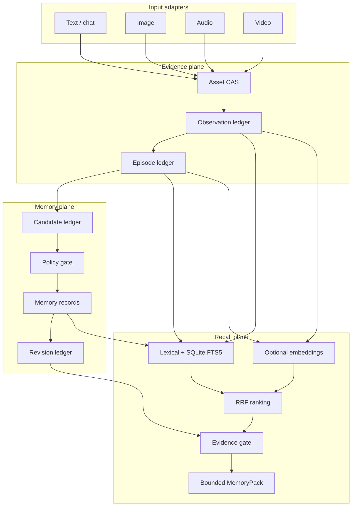
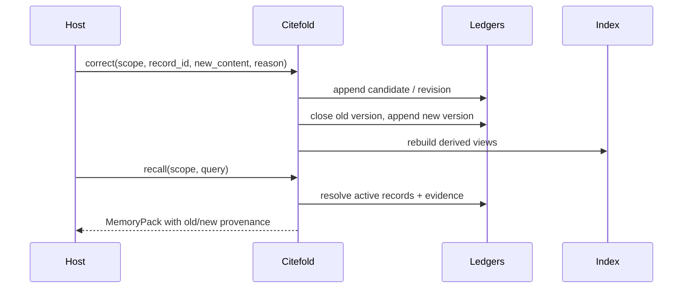

# Architecture

Citefold separates durable evidence, durable memory, and rebuildable retrieval. This makes corrections and deletions inspectable and keeps an index hit from becoming a claim by itself.

## System view



## Write path

1. **Register the asset.** Bytes are hashed and stored in the identity scope. Repeating the same asset is idempotent.
2. **Append observations.** Text spans, OCR output, ASR segments, and visual descriptions retain locators, producer, confidence, and source origin.
3. **Create an episode.** Related observations share a time range, participants, scene, and source metadata.
4. **Propose durable memory.** A candidate includes explicit evidence references, sensitivity, risk, salience, and an intended operation.
5. **Apply policy.** Trusted explicit input can activate only within supported rules. Model, tool, media, and third-party proposals remain pending by default.
6. **Append a revision.** Activation or correction creates a versioned record plus an auditable operation event.
7. **Refresh projections and indexes.** Human-readable Markdown and SQLite are derived views, not the authoritative ledger.

## Read path

1. Validate the complete `MemoryScope`.
2. Refresh a stale local index from ledgers.
3. Retrieve candidates using lexical overlap, SQLite FTS5, and optional embeddings.
4. Merge ranking signals with reciprocal-rank fusion.
5. Resolve results back to canonical records, episodes, observations, and assets.
6. Apply source-origin filters and deletion tombstones.
7. Build citation closure. An Episode hit must resolve to relevant live Observations; an embedding hit cannot stand alone.
8. Select claims and their citations inside one logical budget.
9. Return a structured `MemoryPack` and deterministic Markdown rendering.

`token_budget` is a provider-independent logical budget with a minimum of 256. The Markdown renderer enforces a deterministic ceiling of approximately `token_budget × 4` characters. Applications that need billing-exact token counts should apply their model tokenizer before the final model call.

## Correction and conflict



Contradictory supported claims can remain visible as an unresolved conflict rather than being resolved by recency alone.

## Forgetting and deletion

- `archive(record_id)` changes visibility but retains evidence.
- `forget(evidence_ref)` appends a tombstone and invalidates records whose citation closure no longer survives.
- `forget(..., hard=True)` also removes referenced original and derived asset bytes.
- Asset integrity is checked against its SHA-256. A modified asset invalidates dependent evidence even if no deletion event exists.

Deletion is explicit governance, not a claim that every copy outside Citefold has disappeared. Backups, logs, or model providers remain the host application's responsibility.

## Storage layout

```text
{root}/tenants/{tenant}/users/{user}/namespaces/{namespace}/
  assets/sha256/                 # original and derived assets
  ledgers/
    assets.jsonl
    observations.jsonl
    episodes.jsonl
    candidates.jsonl
    revisions.jsonl
    deletions.jsonl
    model_calls.jsonl
  indexes/memory.sqlite3         # rebuildable FTS / embedding index
  episodes/ profile/ tasks/ ... # human-readable projections
```

Writes are serialized per scope with process/thread locking and atomic replacement for projections. Network filesystem locking and atomicity semantics are not yet validated. See [Limitations](limitations.md).

## Dependencies

- Core local storage and recall: Python standard library.
- Image storage with supplied observations: no system dependency.
- Audio normalization and video extraction: optional `ffmpeg` and `ffprobe` executables.
- Model-backed observation, consolidation, and embeddings: optional [OpenRouter adapter](providers/openrouter.md).
